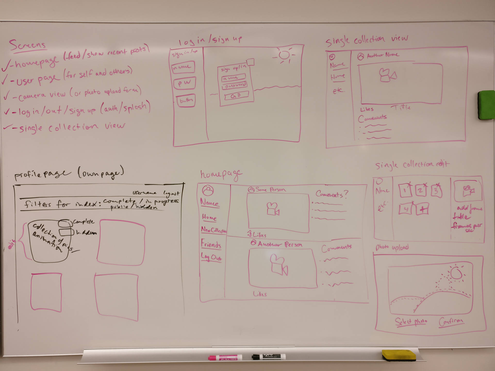

# Reanimator

*Reanimator, photo sharing app to assist users in making timelapse gifs*

[Link to Live App](https://github.com/BillyCaudy/Reanimator)

## Background and Overview
Reanimator's main feature is its ability to generate a timelapse video or gif from users uploading photos. When a user creates a new collection by taking the first photo, they will select an interval at which they want the app to notify them to upload another photo. This could be multiple times per day all the way up to once a month.

Users will have profiles that will allow them to add other profiles as friends. This will populate their homepage with a feed of recently updated collections from their friends.

Primary goals:
* Create a database that can store user profiles with related data and photo collections
* Generate a short video or gif from a collection of photos
* Notifications will be sent to users via email to remind them to take and upload another photo
* Social system for users to friend other users to view their collections on their profiles and in their homepage feed

## Functionality & MVP
1. User authorization (Sign up, log in, log out)
1. Upload and save photos to user collections
1. Generate video or gif from a collection
1. Email notifications for users to take another photo
1. Friending and homepage feed social features
1. Take photos directly from device's camera 
1. Production README

### Bonus Features
1. Friends are able to view individual photos from sequence
1. Build for mobile use

## Technologies & Technical Challenges
This app will be built with the MERN stack. (MongoDB, Express, React, and Node.js)

### Backend
MongoDB will be used for the database. The two main models it will manage are for the users and collectoins of photos. Express will be used to build up a framework to interact with and manage our database information.

### Frontend
Using React/Redux we will create all of our frontend views and manage the frontend state.

### Technical Challenges
* Working with MongoDB and Express to build a new backend
* Creating the timelapse generating technology (Ideally, it would generate a gif)
* Interacting with the user's hardware to take pictures and display ghost of previous image

### Wireframes

### Accomplishments over the weekend ***May 11th & 12th***
1. Majority of documentation
1. Setup database
1. User auth
1. Look into gif generation or animations
1. React skeleton for major views

### Team Members & Division of Responsibilities
- Billy Caudy
  * CSS styling
  * Generating seed data
  * Frontend React components
- Elrashid Elzein
  * Frontend to backend integration
  * Planning CRUD actions
  * Project skeleton setup
  * React setup
- Lance Smith
  * Creating MongoDB server
  * Backend database setup
  * Wireframing and documentation
